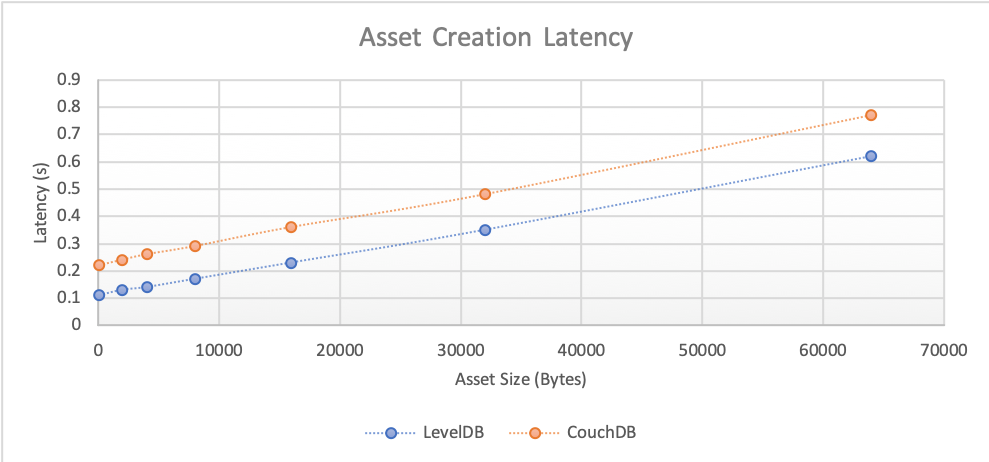
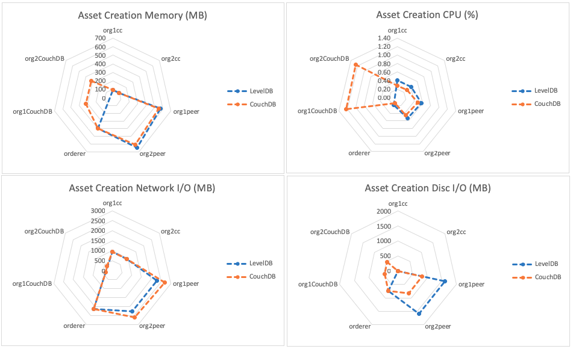

The create asset benchmark consists of submitting `createAsset` gateway transactions for the fixed-asset smart contract deployed within LevelDB and CouchDB networks that uses a 2-of-any endorsement policy. This will result on the method being run on Hyperledger Fabric Peers as required by the endorsement policy and appended to the ledger by the Orderer. The investigated scenarios are targeted at writing to the world state database, resulting in the transaction pathway as depicted in Figure 1.

*Figure 1: Submit Transaction Pathway*

Each transaction inserts a single asset into the world state database.

Achievable throughput and associated latencies are investigated through maintaining a constant transaction backlog for each of the test clients. Successive rounds increase the size of the asset inserted into the world state database.

Resource utilization is investigated for a fixed transaction rate of 125TPS and an asset size of 8Kb.

## Benchmark Results
*LevelDB*

| Asset Size (bytes) | Max Latency (s) | Avg Latency (s) | Throughput (TPS) |
| ------------------ | --------------- | --------------- | ---------------- |
| 100 | 0.48 | 0.11 | 372.5 |
| 2k | 0.55 | 0.13 | 329.2 |
| 4k | 0.60 | 0.14 | 294.7 |
| 8k | 0.71 | 0.17 | 242.0 |
| 16k | 0.76 | 0.23 | 177.6 |
| 32k | 0.95 | 0.35 | 114.3 |
| 64k | 1.45 | 0.62 | 61.2 |

*CouchDB*

| Asset Size (bytes) | Max Latency (s) | Avg Latency (s) | Throughput (TPS) |
| ------------------ | --------------- | --------------- | ---------------- |
| 100 | 0.71 | 0.22 | 194.0 |
| 2K | 0.57 | 0.24 | 179.2 |
| 4K | 0.54 | 0.26 | 164.1 |
| 8K | 0.74 | 0.29 | 147.7 |
| 16K | 0.88 | 0.36 | 119.9 |
| 32K | 0.99 | 0.48 | 88.3 |
| 64K | 1.58 | 0.77 | 51.7 |

*Resource Utilization- 8k Assets @125TPS*

## Benchmark Observations
LevelDB facilitates asset addition at higher TPS and lower latencies than CouchDB. The throughput advantage of LevelDB is lessened with large asset sizes, but the latency advantage is retained.

In comparing the resource utilization of a LevelDB world state database with a CouchDB equivalent during asset creation, a CouchDB world state is CPU intensive, but is beneficial in terms of disc I/O.