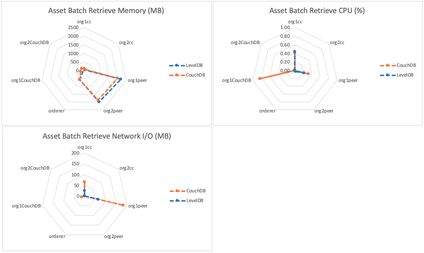

The batch asset retrieval benchmark consists of evaluating `getAssetsFromBatch` gateway transactions for the fixed-asset smart contract deployed within LevelDB and CouchDB networks that uses a 2-of-any endorsement policy. This will result in the method being run on a single Hyperledger Fabric Peer and will not result in any interaction with the Orderer. The investigated scenarios are targeted at reading from the world state database, resulting in the transaction pathway depicted in Figure 1.

*Figure 1: Evaluate Transaction Pathway*

Each transaction retrieves a set of assets, formed by a randomised selection of available UUIDs, from the world state database.

Achievable throughput and associated latencies are investigated through maintaining a constant transaction backlog for each of the test clients. Successive rounds increase the batch size of the assets retrieved from the world state database with a fixed asset size of 8Kb.

Resource utilization is investigated for a fixed transaction rate of 30TPS and a batch size of 20 assets, each of size 8Kb.

## Benchmark Results
*LevelDB*

| Batch Size | Max Latency (s) | Avg Latency (s) | Throughput (TPS) |
| ---------- | --------------- | --------------- | ---------------- |
| 1 | 0.20 | 0.06 | 408.7 |
| 10 | 0.48 | 0.29 | 75.5 |
| 20 | 1.03 | 0.56 | 39.0 |
| 30 | 1.34 | 0.80 | 27.9 |
| 40 | 1.68 | 1.05 | 21.2 |
| 50 | 2.14 | 1.29 | 17.8 |

*CouchDB*

| Batch Size | Max Latency (s) | Avg Latency (s) | Throughput (TPS) |
| ---------- | --------------- | --------------- | ---------------- |
| 1 | 0.15 | 0.03 | 388.9 |
| 10 | 0.46 | 0.18 | 68.5 |
| 20 | 0.64 | 0.32 | 35.6 |
| 30 | 0.84 | 0.46 | 24.2 |
| 40 | 1.10 | 0.60 | 18.5 |
| 50 | 1.32 | 0.74 | 14.9 |

*Resource Utilization- Batch Size 20 @30TPS*

## Benchmark Observations
Use of a LevelDB world state enables higher throughput compared to CouchDB, though this occurs with higher latencies for each transaction.

In comparing a LevelDB world state database with a CouchDB equivalent during batch retrieve, there are similarities with the `Get Asset Benchmark`: implementing a CouchDB incurs a greater CPU and network I/O cost without alleviating CPU utilization of the peer.