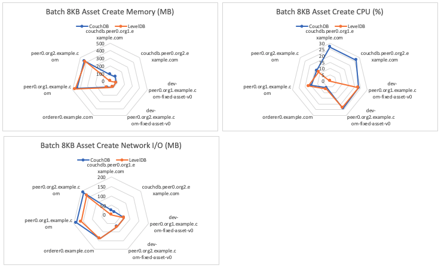

The batch create asset benchmark consists of submitting `createAssetsFromBatch` gateway transactions for the fixed-asset smart contract deployed within LevelDB and CouchDB networks that uses a 2-of-any endorsement policy. This will result on the method being run on Hyperledger Fabric Peers as required by the endorsement policy and appended to the ledger by the Orderer. The investigated scenarios are targeted at writing to the world state database, resulting in the transaction pathway as depicted in Figure 1.

*Figure 1: Submit Transaction Pathway*

Each transaction inserts a set of assets into the world state database.

Achievable throughput and associated latencies are investigated through maintaining a constant transaction backlog of 5 transactions for each of the 4 test clients. Successive rounds increase the batch size of the assets inserted into the world state database with a fixed asset size of 8Kb.

## Benchmark Results
*LevelDB*

| Batch Size | Max Latency (s) | Avg Latency (s) | Throughput (TPS) |
| ---------- | --------------- | --------------- | ---------------- |
| 1 | 0.31 | 0.25 | 59.0 |
| 10 | 1.18 | 0.78 | 19.2 |
| 20 | 2.61 | 1.51 | 10.2 |
| 30 | 5.21 | 2.39 | 6.2 |
| 40 | 8.63 | 3.3 | 4.6 |
| 50 | 9.76 | 4.29 | 3.4 |

*CouchDB*

| Batch Size | Max Latency (s) | Avg Latency (s) | Throughput (TPS) |
| ---------- | --------------- | --------------- | ---------------- |
| 1 | 0.29 | 0.22 | 59.9 |
| 10 | 1.05 | 0.65 | 22.6 |
| 20 | 2.18 | 1.27 | 11.6 |
| 30 | 3.59 | 1.97 | 7.2 |
| 40 | 8.06 | 2.92 | 4.7 |
| 50 | 6.65 | 3.73 | 3.9 |

