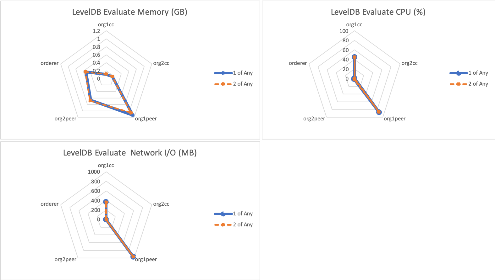
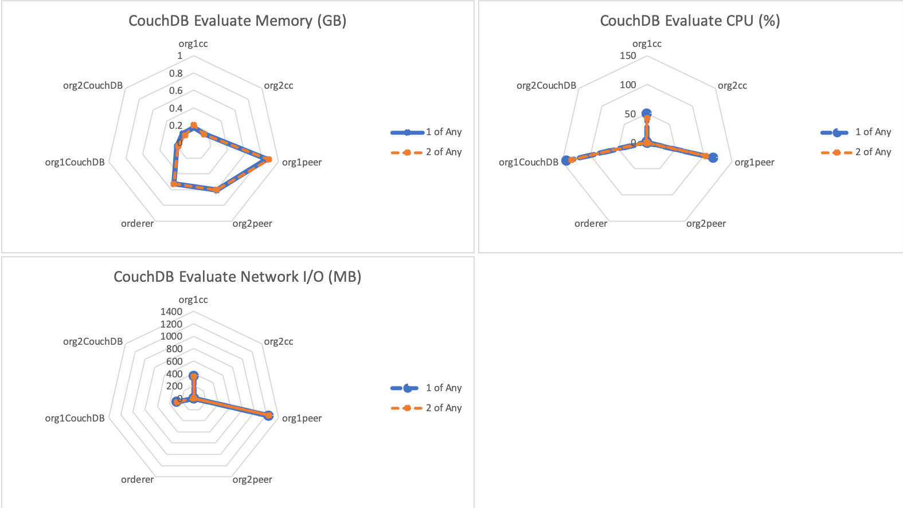
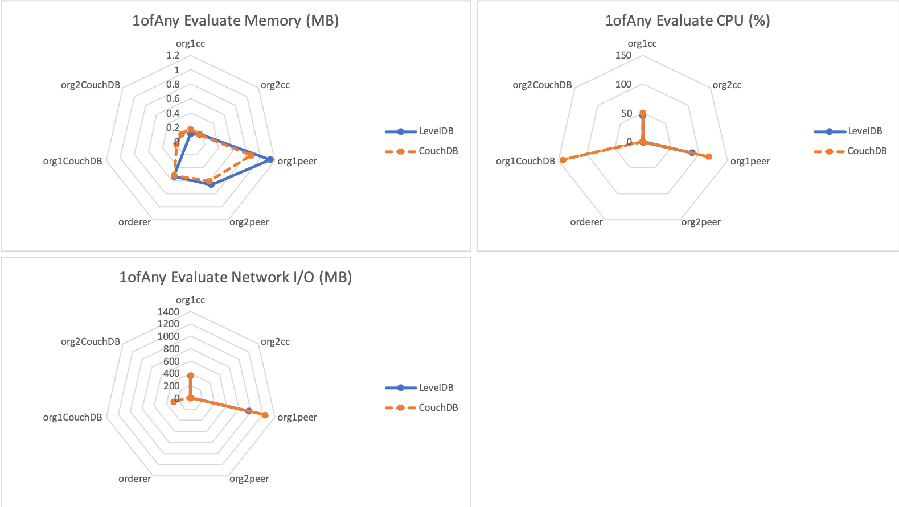
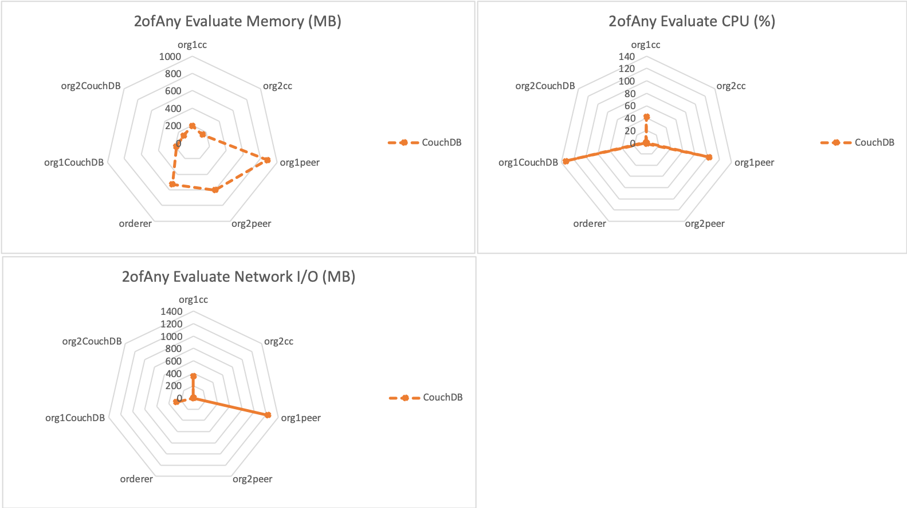

The Empty Contract Benchmark consists of evaluating `emptyContract` gateway transactions for the fixed-asset smart contract deployed within LevelDB and CouchDB networks. This will result on the transaction being run on a single Hyperledger Fabric Peer and will not result in any interaction with the Orderer, resulting in the transaction pathway depicted in Figure 1.

*Figure 1: Evaluate Transaction Pathway*

This is repeated for networks that use the following endorsement policies:
 
 - 1-of-any
 - 2-of-any

Achievable throughput and associated latencies are investigated through maintaining a constant transaction backlog of 100 transactions for each of the 10 test clients.

Resource utilization is investigated for fixed TPS rate of 750TPS.

## Benchmark Results
*LevelDB- evaluate transactions with varying endorsement policy*

| Type | Policy | Max Latency (s) | Avg Latency (s) | Throughput (TPS) |
| ---- | ------ | --------------- | --------------- | ---------------- |
| evaluate | 1-of-any | 1.45 | 0.32 | 1260.9 |
| evaluate | 2-of-any | 1.55 | 0.33 | 982.4 |

*CouchDB- evaluate transactions with varying endorsement policy*

| Type | Policy | Max Latency (s) | Avg Latency (s) | Throughput (TPS) |
| ---- | ------ | --------------- | --------------- | ---------------- |
| evaluate | 1-of-any | 1.59 | 0.55	| 1068.2 |
| evaluate | 2-of-any | 1.65 | 0.55 | 1079.9 |

*LevelDB Resource Utilization– Evaluate By Policy @750TPS*

*CouchDB Resource Utilization– Evaluate By Policy @750TPS*

*Resource Utilization– Evaluate 1ofAny Policy @750TPS*

*Resource Utilization– Evaluate 2ofAny Policy @750TPS*

## Benchmark Observations
With a fixed world state database, the endorsement policy has no impact on the consumed resources when evaluating gateway transactions.

In comparing a LevelDB world state database with a CouchDB world state database, the throughput of a 1-of endorsement policy is higher with LevelDB than its CouchDB equivalent, and the throughput of a 2-of endorsement policy is lower with LevelDB thatn its CouchDB equivalent. The transaction latency is generarlly lower with a LevelDB world state database than with a CouchDB world state database.

There is no appreciable difference in the achievable CPU or network I/O consumed by either implementation when varying the endorsement policy. There is a slight cost in additional memory requirements for the use of a LevelDB world state store.
