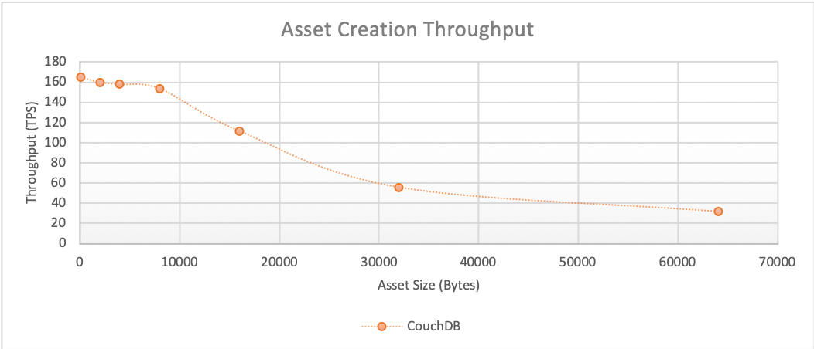
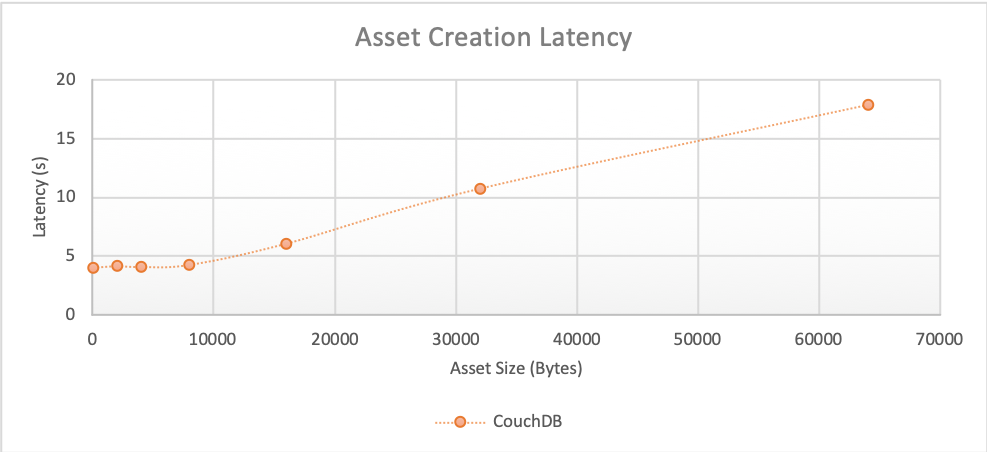
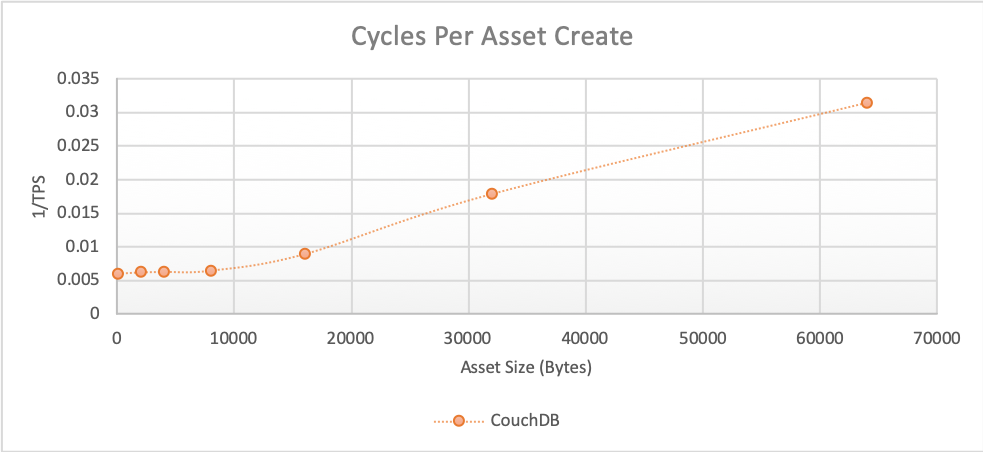

The create asset benchmark consists of submitting `createAsset` gateway transactions for the fixed-asset smart contract deployed within LevelDB and CouchDB networks that uses a 2-of-any endorsement policy. This will result in the method being run on Hyperledger Fabric Peers as required by the endorsement policy and appended to the ledger by the Orderer. The investigated scenarios are targeted at writing to the world state database, resulting in the transaction pathway as depicted in Figure 1.

*Figure 1: Submit Transaction Pathway*

Each transaction inserts a single asset into the world state database.

Achievable throughput and associated latencies are investigated through maintaining a constant transaction backlog of 10 transactions for each of the 10 test clients running on LevelDB, and a constant transaction backlog of 100 transactions for each of the 10 test clients running on CouchDB.

## Benchmark Results
*LevelDB*

| Asset Size (bytes) | Max Latency (s) | Avg Latency (s) | Throughput (TPS) |
| ------------------ | --------------- | --------------- | ---------------- |
| 100 | 0.56 | 0.33 | 186.1 |
| 2K | 0.51 | 0.34 | 180.1 |
| 4K | 0.51 | 0.36 | 173.8 |
| 8K | 0.54 | 0.36 | 170.0 |
| 16K | 0.84 | 0.48 | 127.3 |
| 32K | 2.24 | 1.01 | 53.4 |
| 64K | 5.14 | 1.75 | 29.3 |

*CouchDB*

| Asset Size (bytes) | Max Latency (s) | Avg Latency (s) | Throughput (TPS) |
| ------------------ | --------------- | --------------- | ---------------- |
| 100 | 8.81 | 4.04 | 165.1 |
| 2K | 9.02 | 4.17 | 160.0 |
| 4K | 8.64 | 4.11 | 158.0 |
| 8K | 8.66 | 4.28 | 153.7 |
| 16K | 14.08 | 6.08 | 111.7 |
| 32K | 25.23 | 10.75 | 55.9 |
| 64K | 40.74 | 17.85 | 31.8 |

## Benchmark Observations
LevelDB facilitates asset addition at higher throughput and lower latencies than CouchDB. The throughput advantage of LevelDB is lessened with large asset sizes, but the latency advantage is retained.
