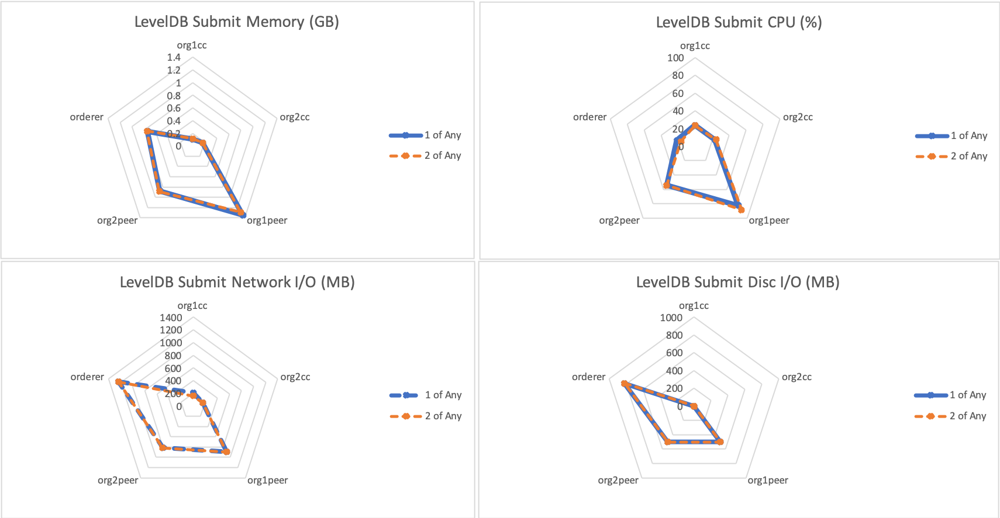
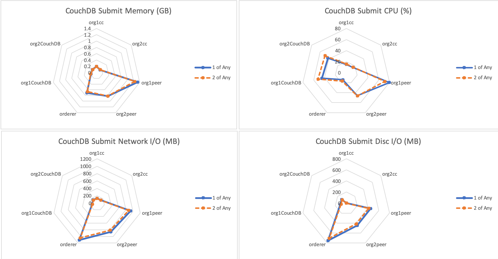
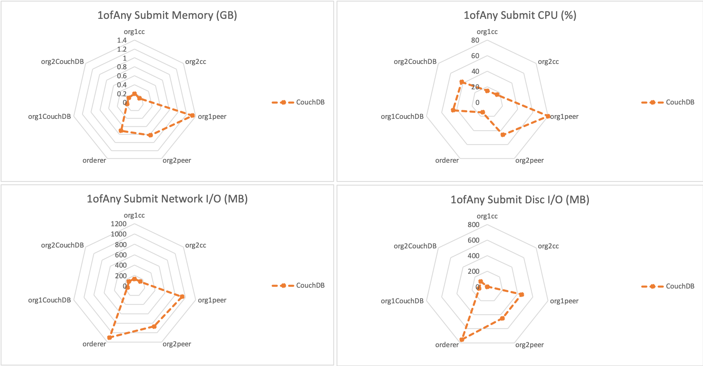
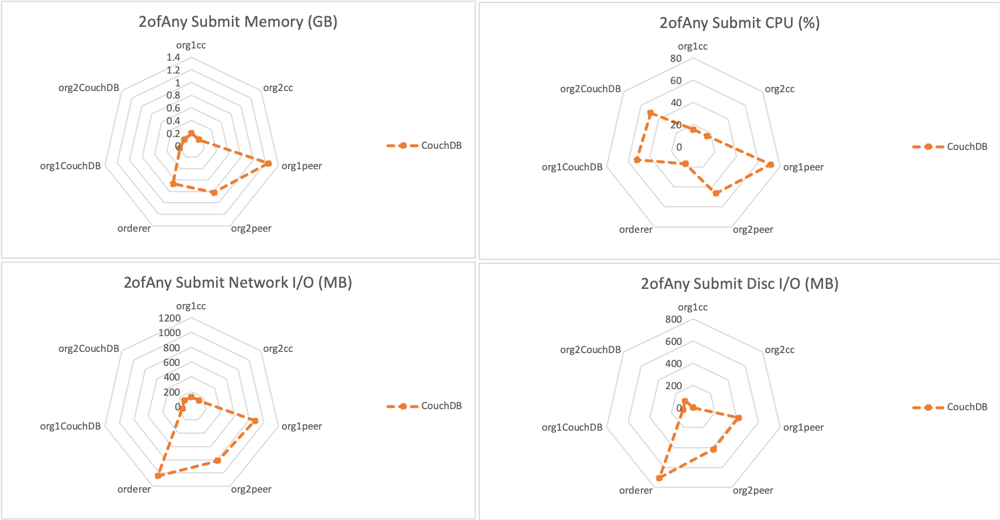

The Empty Contract Benchmark consists of submitting `emptyContract` gateway transactions for the fixed-asset smart contract deployed within LevelDB and CouchDB networks. When submitting `emptyContract` gateway transactions, the interaction is recorded on the ledger. This results in the transaction pathway as depicted in Figure 1.

*Figure 1: Submit Empty Contract Transaction Pathway*

This is repeated for networks that use the following endorsement policies:
 
 - 1-of-any
 - 2-of-any

Achievable throughput and associated latencies are investigated through maintaining a constant transaction backlog of 100 transactions for each of the 10 test clients.

Resource utilization is investigated for fixed TPS rate of 350TPS and 300TPS.

## Benchmark Results
*LevelDB- evaluate transactions with varying endorsement policy*

| Type | Policy | Max Latency (s) | Avg Latency (s) | Throughput (TPS) |
| ---- | ------ | --------------- | --------------- | ---------------- |
| submit | 1-of-any | 1.78 | 0.56 | 354.6 |
| submit | 2-of-any | 1.81 | 0.51 | 359.0 |

*CouchDB- submit transactions with varying endorsement policy*

| Type | Policy | Max Latency (s) | Avg Latency (s) | Throughput (TPS) |
| ---- | ------ | --------------- | --------------- | ---------------- |
| submit | 1-of-any | 3.94 | 1.74 | 287.0 |
| submit | 2-of-any | 3.80 | 1.75 | 290.6 |

*LevelDB Resource Utilization– Submit By Policy @350TPS*

*CouchDB Resource Utilization– Submit By Policy @350TPS for 1ofAny Policy and @300TPS for 2ofAny Policy*

*Resource Utilization– Submit 1ofAny Policy @350TPS*

*Resource Utilization– Submit 2ofAny Policy @300TPS for CouchDB and @350TPS for LevelDB*

## Benchmark Observations
With a fixed world state database, the endorsement policy has no impact on the consumed resources when evaluating gateway transactions.

In comparing a LevelDB world state database with a CouchDB world state database, the throughput of is higher with LevelDB than its CouchDB equivalent, and the transaction latency is lower with a LevelDB world state database than with a CouchDB world state database.

There is no appreciable difference in the achievable CPU or network I/O consumed by either implementation when varying the endorsement policy. There is a slight cost in additional memory requirements for the use of a LevelDB world state store.
