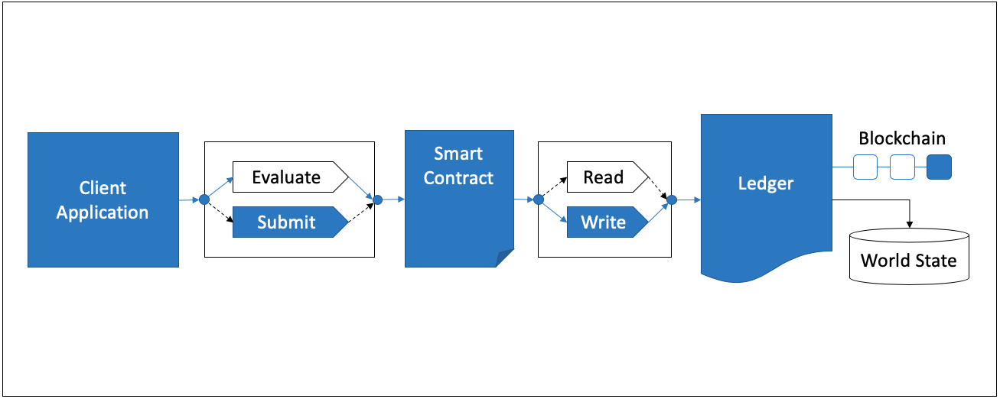

The Empty Contract Benchmark consists of submitting `emptyContract` gateway transactions for the fixed-asset smart contract deployed within LevelDB and CouchDB networks. When submitting `emptyContract` gateway transactions, the interaction is recorded on the ledger. This results in the transaction pathway as depicted in Figure 1.

*Figure 1: Submit Empty Contract Transaction Pathway*

This is repeated for networks that use the following endorsement policies:
 
 - 1-of-any
 - 2-of-any

## Benchmark Results
*LevelDB- submit transactions with varying endorsement policy*

| Type | Policy | Max Latency (s) | Avg Latency (s) | Throughput (TPS) |
| ---- | ------ | --------------- | --------------- | ---------------- |
| submit | 1-of-any | 3.76 | 1.70 | 621.3 |
| submit | 2-of-any | 3.28 | 1.77 | 624.4 |

*CouchDB- submit transactions with varying endorsement policy*

| Type | Policy | Max Latency (s) | Avg Latency (s) | Throughput (TPS) |
| ---- | ------ | --------------- | --------------- | ---------------- |
| submit | 1-of-any | 3.76 | 1.70 | 605.3 |
| submit | 2-of-any | 3.28 | 1.77 | 637.4 |


## Benchmark Configuration File
<details>
  <summary>Click to expand LevelDB 1OF Benchmark Configuration</summary>

```
workers:
  type: local
  number: 10
rounds:
  - label: empty-contract-submit
    description: >-
      Test a submitTransaction() Gateway method against the Go `fixed-asset`
      Smart Contract method named `nullResponse`, which immediately returns a
      null response. This represents the fastest possible round trip time for a
      submitTransaction() method that does not touch the world state or perform
      any action.
    chaincodeID: fixed-asset
    txDuration: 300
    rateControl:
      type: fixed-backlog
      opts:
        unfinished_per_client: 200
    arguments:
      chaincodeID: fixed-asset
      consensus: true
    callback: benchmarks/api/fabric/lib/empty-contract.js
```
</details>

<details>
  <summary>Click to expand LevelDB 2OF Benchmark Configuration</summary>

```
workers:
  type: local
  number: 10
rounds:
  - label: empty-contract-submit
    description: >-
      Test a submitTransaction() Gateway method against the Go `fixed-asset`
      Smart Contract method named `nullResponse`, which immediately returns a
      null response. This represents the fastest possible round trip time for a
      submitTransaction() method that does not touch the world state or perform
      any action.
    chaincodeID: fixed-asset
    txDuration: 300
    rateControl:
      type: fixed-backlog
      opts:
        unfinished_per_client: 200
    arguments:
      chaincodeID: fixed-asset
      consensus: true
    callback: benchmarks/api/fabric/lib/empty-contract.js
```
</details>

<details>
  <summary>Click to expand CouchDB 1OF Benchmark Configuration</summary>

```
workers:
  type: local
  number: 10
rounds:
  - label: empty-contract-submit
    description: >-
      Test a submitTransaction() Gateway method against the Go `fixed-asset`
      Smart Contract method named `nullResponse`, which immediately returns a
      null response. This represents the fastest possible round trip time for a
      submitTransaction() method that does not touch the world state or perform
      any action.
    chaincodeID: fixed-asset
    txDuration: 300
    rateControl:
      type: fixed-backlog
      opts:
        unfinished_per_client: 200
    arguments:
      chaincodeID: fixed-asset
      consensus: true
    callback: benchmarks/api/fabric/lib/empty-contract.js
```
</details>

<details>
  <summary>Click to expand CouchDB 2OF Benchmark Configuration</summary>
  
```
workers:
  type: local
  number: 10
rounds:
  - label: empty-contract-submit
    description: >-
      Test a submitTransaction() Gateway method against the Go `fixed-asset`
      Smart Contract method named `nullResponse`, which immediately returns a
      null response. This represents the fastest possible round trip time for a
      submitTransaction() method that does not touch the world state or perform
      any action.
    chaincodeID: fixed-asset
    txDuration: 300
    rateControl:
      type: fixed-backlog
      opts:
        unfinished_per_client: 200
        startingTps: 10
    arguments:
      chaincodeID: fixed-asset
      consensus: true
    callback: benchmarks/api/fabric/lib/empty-contract.js
```
</details>