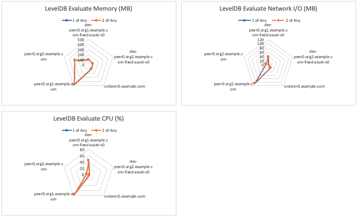
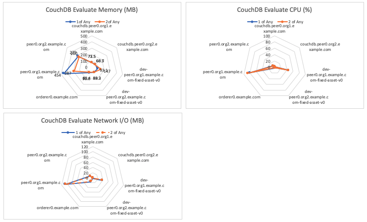

The Empty Contract Benchmark consists of evaluating `emptyContract` gateway transactions for the fixed-asset smart contract deployed within LevelDB and CouchDB networks. This will result on the transaction being run on a single Hyperledger Fabric Peer and will not result in any interaction with the Orderer, resulting in the transaction pathway depicted in Figure 1.

*Figure 1: Evaluate Transaction Pathway*

This is repeated for networks that use the following endorsement policies:
 
 - 1-of-any
 - 2-of-any

Achievable throughput and associated latencies are investigated through maintaining a constant transaction backlog of 100 transactions for each of the 10 test clients.

Resource utilization is investigated for fixed TPS rate of 750TPS.

## Benchmark Results
*LevelDB- evaluate transactions with varying endorsement policy*

| Type | Policy | Max Latency (s) | Avg Latency (s) | Throughput (TPS) |
| ---- | ------ | --------------- | --------------- | ---------------- |
| evaluate | 1-of-any | 0.75 | 0.33 | 1387.3 |
| evaluate | 2-of-any | 0.80 | 0.32 | 1407.0 |

*CouchDB- evaluate transactions with varying endorsement policy*

| Type | Policy | Max Latency (s) | Avg Latency (s) | Throughput (TPS) |
| ---- | ------ | --------------- | --------------- | ---------------- |
| evaluate | 1-of-any | 0.77 | 0.39	| 1185.1 |
| evaluate | 2-of-any | 0.73 | 0.36 | 1381.9 |

*LevelDB Resource Utilization– Evaluate By Policy @750TPS*

*CouchDB Resource Utilization– Evaluate By Policy @750TPS*

*Resource Utilization– Evaluate 1ofAny Policy @750TPS*

*Resource Utilization– Evaluate 2ofAny Policy @750TPS*

