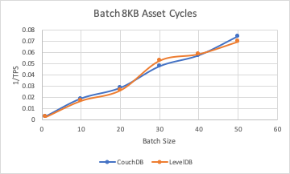
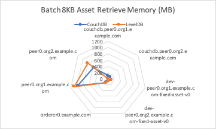

The batch asset retrieval benchmark consists of evaluating `getAssetsFromBatch` gateway transactions for the fixed-asset smart contract deployed within LevelDB and CouchDB networks that uses a 2-of-any endorsement policy. This will result in the method being run on a single Hyperledger Fabric Peer and will not result in any interaction with the Orderer. The investigated scenarios are targeted at reading from the world state database, resulting in the transaction pathway depicted in Figure 1.

*Figure 1: Evaluate Transaction Pathway*

Each transaction retrieves a set of assets, formed by a randomised selection of available UUIDs, from the world state database.

Achievable throughput and associated latencies are investigated through maintaining a constant transaction backlog of 20 transactions for each of the 10 test clients. Successive rounds increase the batch size of the assets retrieved from the world state database with a fixed asset size of 8Kb.

## Benchmark Results
*LevelDB*

| Batch Size | Max Latency (s) | Avg Latency (s) | Throughput (TPS) |
| ---------- | --------------- | --------------- | ---------------- |
| 1  | 1.27 | 0.46 | 384.8 |
| 10 | 3.54 | 1.66 | 58.7 |
| 20 | 5.39 | 2.75 | 37.8 |
| 30 | 9.42 | 4.98 | 18.9 |
| 40 | 11.07 | 5.67 | 17.0 |
| 50 | 13.71 | 6.00 | 14.3 |

*CouchDB*

| Batch Size | Max Latency (s) | Avg Latency (s) | Throughput (TPS) |
| ---------- | --------------- | --------------- | ---------------- |
| 1 | 1.17 | 0.41| 363.2 |
| 10 | 4.03 | 1.93 | 53.4 |
| 20 | 5.80 | 2.93 | 35.3 |
| 30 | 9.80 | 4.80 | 21.0 |
| 40 | 11.73 | 5.22 | 17.4 |
| 50 | 15.13 | 6.42 | 13.4 |

*Resource Utilization- Batch Size 20 @30TPS*

