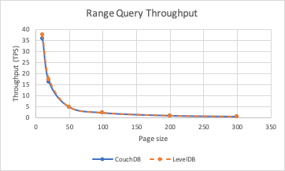
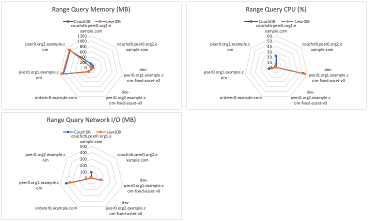

The paginated range query benchmark consists of evaluating `paginatedRangeQuery` gateway transactions for the fixed-asset smart contract deployed within LevelDB and CouchDB networks that use a 2-of-any endorsement policy. This will result in the method being run on a single Hyperledger Fabric Peer and will not result in any interaction with the Orderer. The investigated scenarios are targeted at reading from the world state database, resulting in the transaction pathway depicted in Figure 1.

*Figure 1: Evaluate Transaction Pathway*

Each transaction retrieves a fixed number of mixed byte size assets in the range [100, 1000, 2000, 4000, 8000, 16000, 32000, 64000] from the world state database.

Achievable throughput and associated latencies are investigated through maintaining a constant transaction backlog of 2 transactions for each of the 4 test clients. Successive rounds increase the page size of assets retrieved from the world state database.

## Benchmark Results
*LevelDB*

| Page Size | Max Latency (s) | Avg Latency (s) | Throughput (TPS) |
| --------- | --------------- | --------------- | ---------------- |
| 10 | 0.74 | 0.22 | 37.6 |
| 20 | 1.08 | 0.50 | 17.1 |
| 50 | 3.80 | 1.86 | 4.7 |
| 100 | 7.92 | 4.18 | 2.1 |
| 200 | 22.40 | 10.06 | 0.8 |
| 300 | 29.95 | 14.99 | 0.4 |

*CouchDB*

| Page Size | Max Latency (s) | Avg Latency (s) | Throughput (TPS) |
| --------- | --------------- | --------------- | ---------------- |
| 10 | 1.00 | 0.24 | 35.8 |
| 20 | 0.98 | 0.52 | 15.9 |
| 50 | 2.85 | 1.83 | 4.6 |
| 100 | 8.67 | 4.29 | 2.0 |
| 200 | 18.49 | 9.75 | 0.7 |
| 300 | 27.46 | 15.95 | 0.3 |

