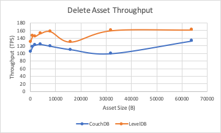
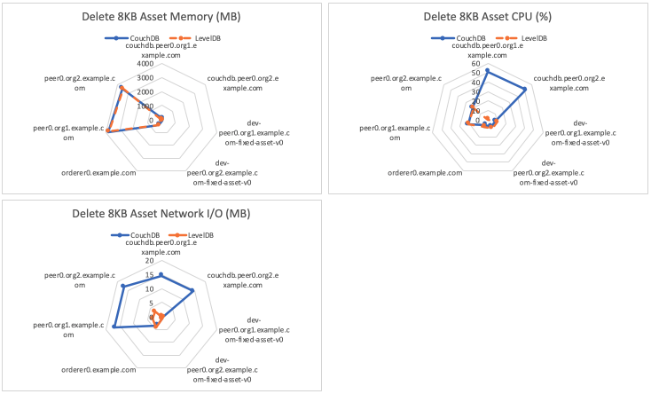

The delete asset benchmark consists of submitting `deleteAsset` gateway transactions for the fixed-asset smart contract deployed within LevelDB and CouchDB networks that uses a 2-of-any endorsement policy. This will result in the method being run on Hyperledger Fabric Peers as required by the endorsement policy and appended to the ledger by the Orderer. The investigated scenarios are targeted at writing to the world state database, resulting in the transaction pathway as depicted in Figure 1.

*Figure 1: Submit Transaction Pathway*

Each transaction deletes a single asset with a randomised UUID from the world state database.

Achievable throughput and associated latencies are investigated through maintaining a constant transaction backlog of 20 transactions for each of the 5 test clients running on LevelDB, and a constant transaction backlog of 100 transactions for each of the 5 test clients running on CouchDB.

## Benchmark Results
*LevelDB*

| Asset Size (bytes) | Max Latency (s) | Avg Latency (s) | Throughput (TPS) |
| ------------------ | --------------- | --------------- | ---------------- |
| 100 | 0.27 | 0.25 | 130.2 |
| 1K | 0.26 | 0.25 | 145.6 |
| 2K | 0.26 | 0.24 | 144.8 |
| 4K | 0.26 | 0.24 | 152.1 |
| 8K | 0.26 | 0.25 | 157.4 |
| 16K | 0.26 | 0.24 | 129.6 |
| 32K | 0.27 | 0.25 | 160.0 |
| 64K | 0.26 | 0.25 | 162.0 |

*CouchDB*

| Asset Size (bytes) | Max Latency (s) | Avg Latency (s) | Throughput (TPS) |
| ------------------ | --------------- | --------------- | ---------------- |
| 100 | 0.35 | 0.30 | 104.1 |
| 1K | 0.34 | 0.29 | 117.5 |
| 2K | 0.34 | 0.30 | 121.6 |
| 4K | 0.35 | 0.29 | 123.5 |
| 8K | 20.35 | 0.29 | 118.7 |
| 16K | 0.33 | 0.29 | 109.5 |
| 32K | 0.36 | 0.29 | 98.8 |
| 64K | 0.38 | 0.32 | 123.8 |

